# 1.2 The Need of Model Deployment

Common Problems in Machine Learning:
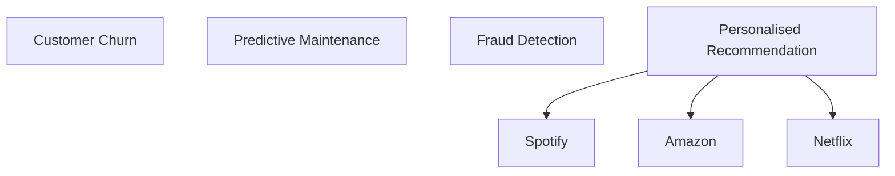

**Process for ML Process**

- Gather Data
- Data Exploration -> Corelation (Univariate/ Bivariate Analysis)
- Preprocessing Data 
- Train Model -> Evaluate -> Hyperparameter Tuning (Decision Trees/Neural Networks/ XG Boost etc.)
- Tuning (Gennie)
- Best Model -> Deployment

Best model -> | How to expose the best model | --> customer

**Challenges with Python Nb:**
-  Accessability (Lot of Py code + company secrets)
-  need a simple way w/o exposing company's secrets
-  ensure dependencies are taken care of at customer's end (Platform Agnostic)
-  make sure ML model is generatinf recommendations that is fast enough (Latency/ Lag is min)
-  Approch is scalable (Horizontal scaling)

=================================================

# 1.3  Introduction to Model Deployment    

1. How can we share the model?
   - the model should also be re-trainable
2. Platform Agnostic

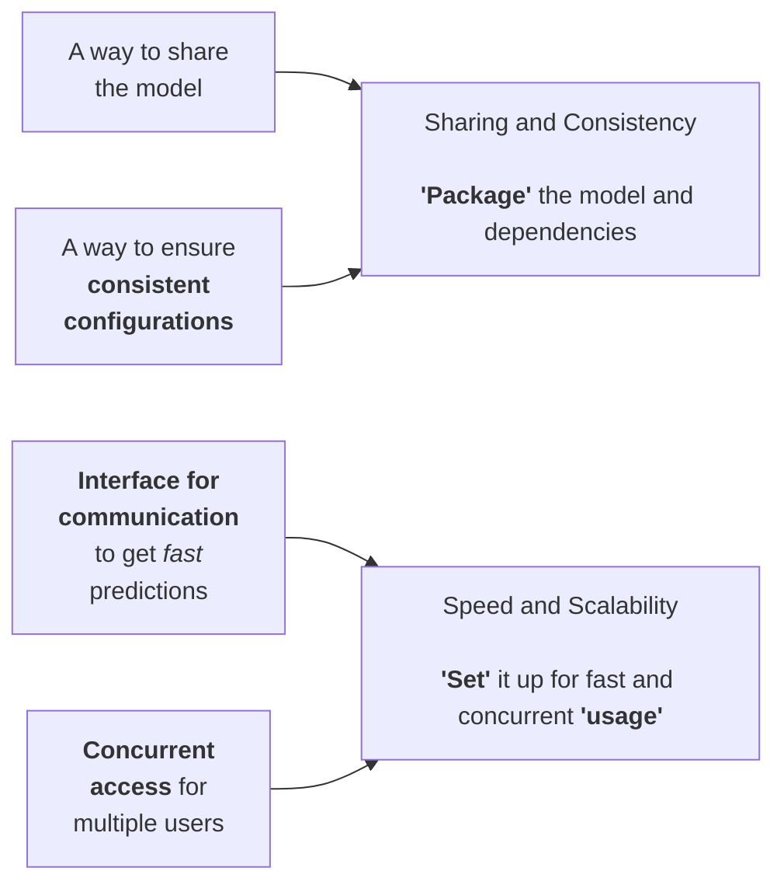

**Model Deployment**
- taking a trained ML model, package it and set it up for inference
- - we dont train it during deployment

**How do we package it?**

=================================================

# 1.4  Need for Model Serialization

**Environment**
- set of specific cond. and config under which software and systems operate

1. Development Environment
   - used for training ML models by `hyperparameter tuning`
2. Production Environment
   - used to deploy final ML model to serve end users

=================================================

# 1.5 Introduction to Model Serialization

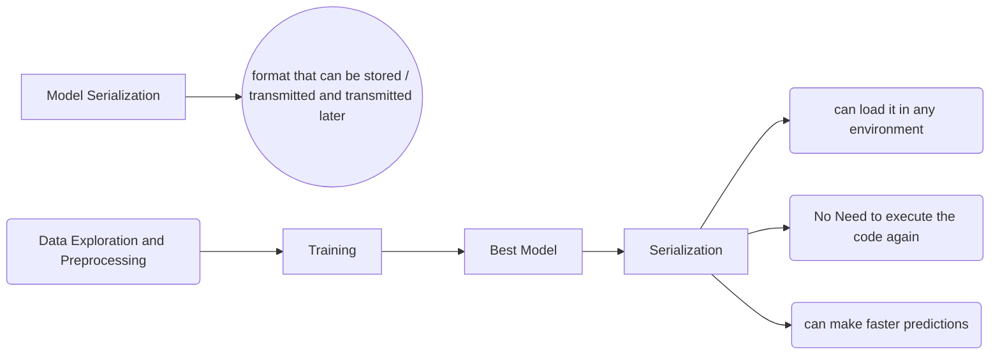

**Model Serilization Formats**

- Pickle : save/ load in pyhon for quick and loaal use
- Joblib : large NumPy models
- ONNX : Deploying across diff frameworks / running them on edge devices
- TensorFLowModel: deploy deep learning model in production with TF 

**The main idea:**

- We need to serialize the best model along witht he data preprocessing steps that were used to preprocess the data used to train the model

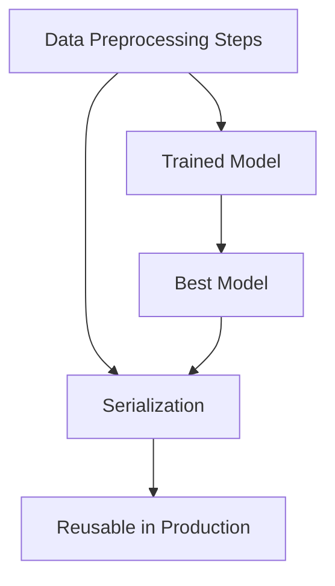

=================================================

# 1.6 Introduction to API's

### Need for a Communication interface

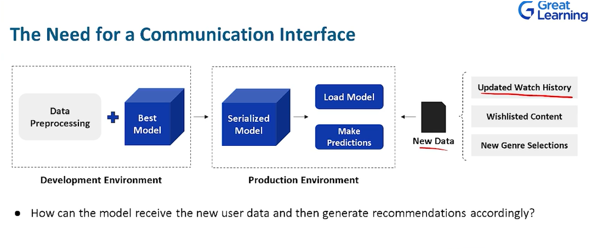

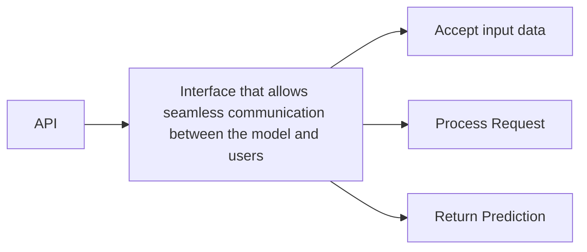

### Application Programming Interface API

API :- Mechanism that enables two software components to `communicate` with each other `using a set of definations/ protocols`

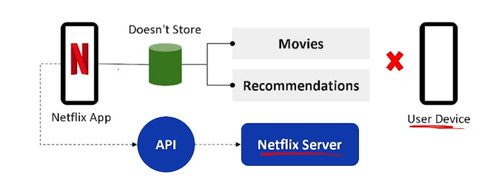

### HTTP Methods

- when a user wants to get predictions from a model , they need to send a request

**API request:**
- is a message sent to a server asking an API to provide a service / information

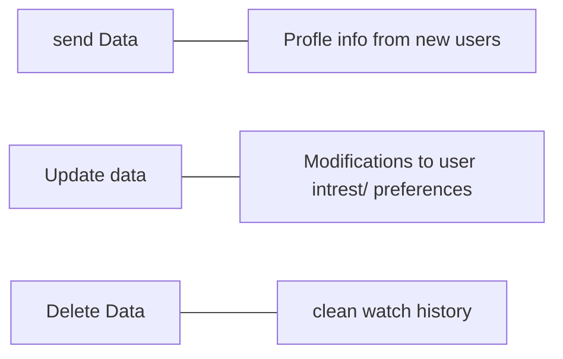

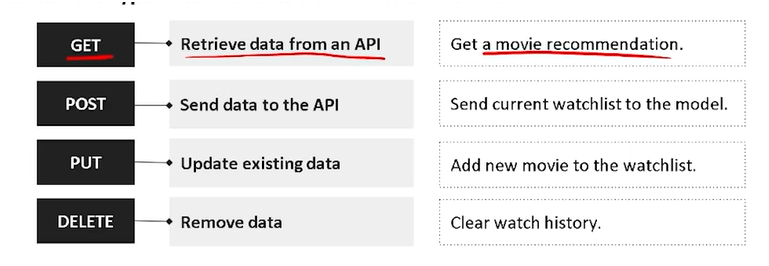

#### HTTP status codes

| Status Code | Status Message        | Description                       |
| ----------- | --------------------- | --------------------------------- |
| 200         | OK                    | Request was successful            |
| 400         | Bad Request           | request Invalid                   |
| 401         | Unauthorized          | Authentication reqd               |
| 403         | Forbidden             | access not allowed                |
| 404         | Not Found             | Requested resource does not exist |
| 500         | Internal Server Error | The server encountered an error   |

# 1.7 Introduction to Endpoints

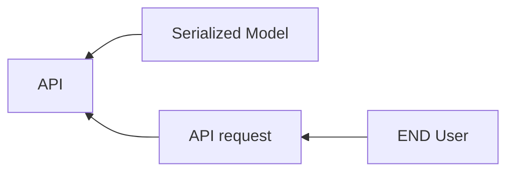

-API endpoints make it easy for the end user

- an API endpoint is a digital location where API recieves API requests, for resources on its server

# 1.8 Handling Dependencies

- Diffrent users/machines can have different envirionments
  - for example Numpy verion might be different acrosss different machines and this can affect the experience of two different users
  

  - In Python we can create a  `Dependencies` file  that act as a blueprint for recreating the exact environment where the model was trained and tested
    - such a file is usually a `requirements.txt` file  which creates a reproducible environment
  

 # 1.9 Securely Hosting a Deployed Model

  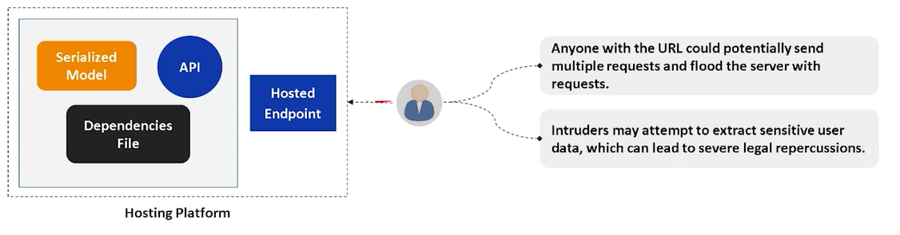

**Security**

- `Access Keys` : Its a unique identifier to authenticate and authorise a user/application to access a secure resource

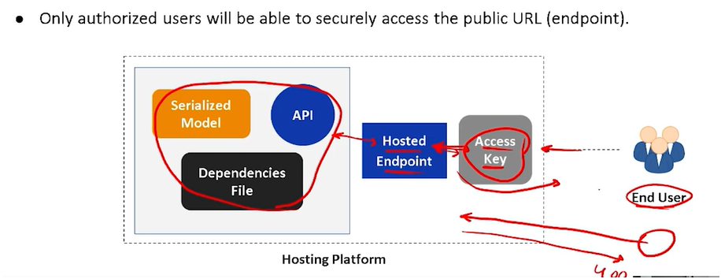

# 1.10 Architecture of Model Deployment

 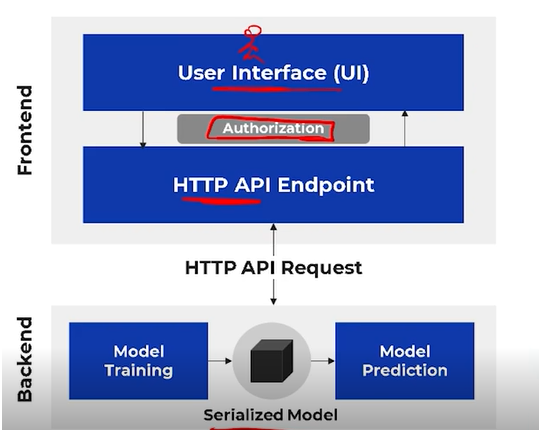

 # 1.11 Model Deploymenr - Learning Outcomes and Summary

 - You cannot share jupyter nb as an ML solution with end users as this is enfficient
   - dependency issue
   - Not Fast
   - Not consistent
   - scalability

- Deployment should be done by serialization 
  - make it as a binary
    - different format
      - ONYX
      - PICKLE
      - Tensor flow
  - API
    - HTTP methods
      - status codes
  
    - Idea of Endpoints
      - Hosting
        - cloud solutions
    - Dependency Handling
      - we have requirements.txt to replicate what we have in the production env
    - Security
      - Access keys
    - Architecture:
      - Backend: Server
      - Frontend : End user will only communicate on frontend

# 1.12 - 1.16 Case Study

