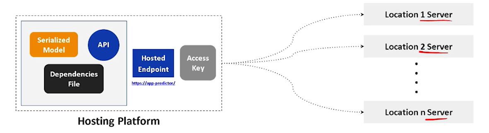
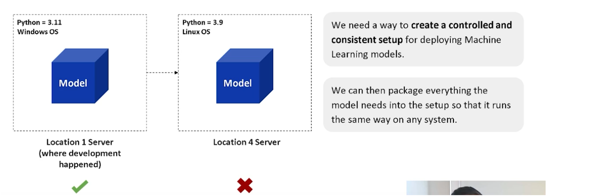
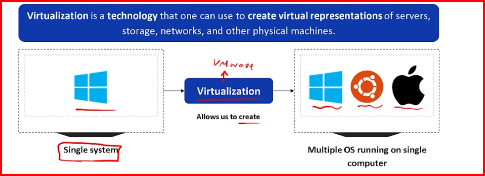
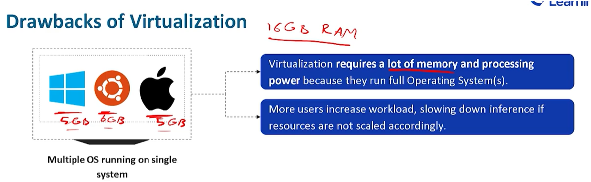
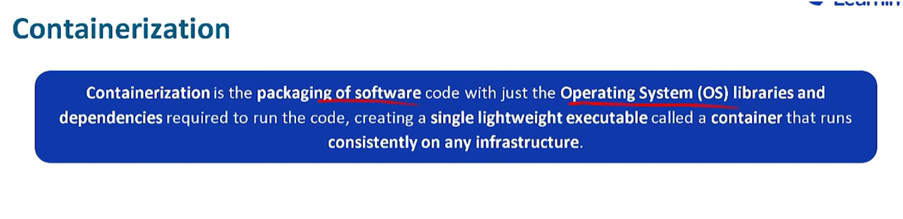
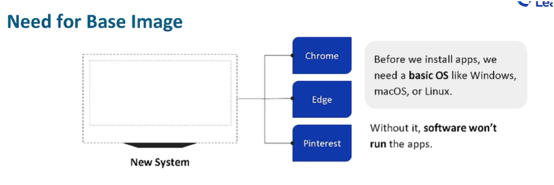
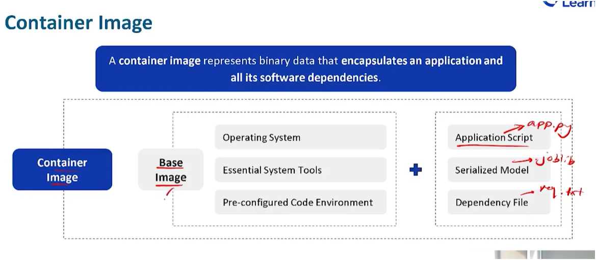

# Week 2: Containerization

# 2.1 Agenda

- Docker
- REST API
- Scalability
- Integrate ML application to existing enterprise solns.

- chaLLenges in Model deployments
- need for Virtulization + Containerization
- Images in Containerization
- Dockerfile
- REST API framework

# 2.2 challenges with Model Deployment

1. Performance:
    - single hosted application on a single computer
2. Scalability
    - response times higher if users are from diff geographic regions

  

- **Problems with pip**:
  - pip can only determine which packages to install from the requirements.txt file but has no control over the version of python installed on the user's machines
  
- **OS based folders structure**
-   C:\\ vs /folder/file [Windows vs linux]
  

- **Drivers**
  - GPUS
    - made by different vendors like NVIDIA (cuda)
    - Intel
    - Apple (metal) etc..

So basically requirements.txt might not be a comprehensive soln to handle all such OS related dependencies

# 2.3 Virtulization and Containerization

## Virulization

- technology that one can creare virtual representations of servers, storage , networks and other physical machines

Virtual machine goes into a container

# 2.4 Images in Containerization

Base image is starting point for most container-based development workflows

## Container Image

# 2.5 Introduction to Dockerfile

