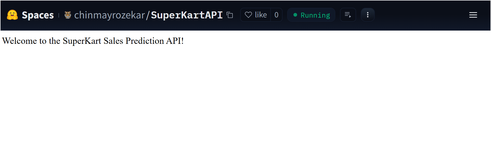
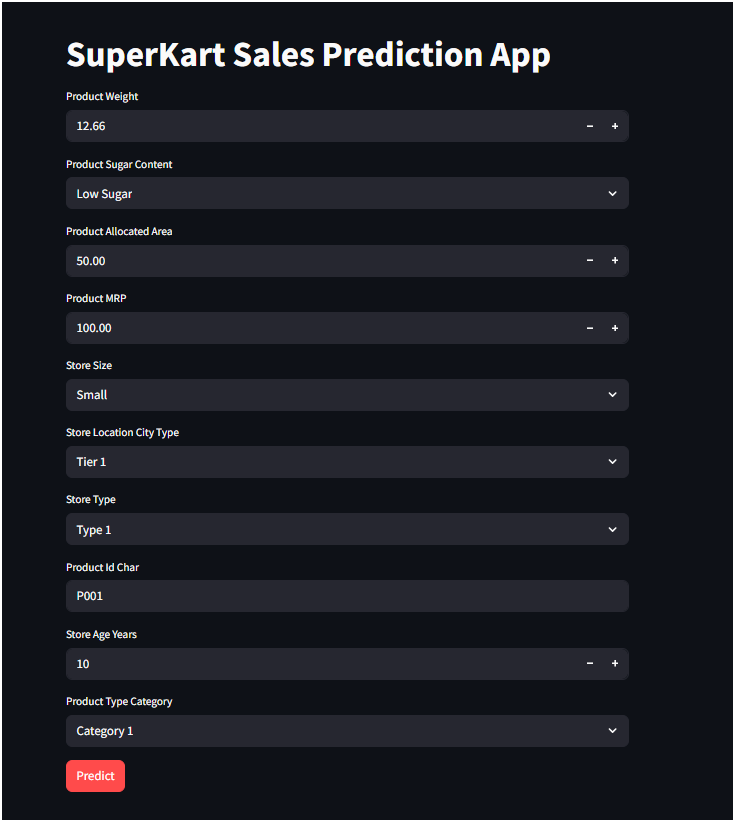

# Project SuperKart Trouble Shooting Notes

## These slides are a collection of Potential Issues someone can run into

by  **Chinmay Rozekar**

Original Credits: *Todd Grayson* (PGPAIML)

---

# Deployment Backend


This is the issue i faced:


---
**This is the line causing the fail:**

- `model = joblib.load("backend_files/xgb_tuned_model.joblib") `

- I fixed it to 

  - `model = joblib.load("xgb_tuned_model.joblib") `

and the issue with 

`gunicorn.errors.HaltServer: <HaltServer 'Worker failed to boot.' 3>`

got resolved.

please see full code on next slide

---


```
%%writefile backend_files/app.py

# Import necessary libraries
import numpy as np
import joblib  # For loading the serialized model
import pandas as pd  # For data manipulation
from flask import Flask, request, jsonify  # For creating the Flask API

# Initialize Flask app with a name
superkart_api = Flask("SuperKartSalesAPI") 

# Load the trained churn prediction model
# model = joblib.load("backend_files/xgb_tuned_model.joblib") 
model = joblib.load("xgb_tuned_model.joblib") 
# Define a route for the home page
@superkart_api.get('/')
def home():
    return "Welcome to the SuperKart Sales Prediction API!"

# Define an endpoint to predict churn for a single customer
@superkart_api.post('/v1/predict')
def predict_sales():
    # Get JSON data from the request
    data = request.get_json()

    # Extract relevant customer features from the input data. The order of the column names matters.
    sample = {
        'Product_Weight': data['Product_Weight'],
        'Product_Sugar_Content': data['Product_Sugar_Content'],
        'Product_Allocated_Area': data['Product_Allocated_Area'],
        'Product_MRP': data['Product_MRP'],
        'Store_Size': data['Store_Size'],
        'Store_Location_City_Type': data['Store_Location_City_Type'],
        'Store_Type': data['Store_Type'],
        'Product_Id_char': data['Product_Id_char'],
        'Store_Age_Years': data['Store_Age_Years'],
        'Product_Type_Category': data['Product_Type_Category']
    }

    # Convert the extracted data into a DataFrame
    input_data = pd.DataFrame([sample])

    # Make a churn prediction using the trained model
    prediction = model.predict(input_data).tolist()[0]

    # Return the prediction as a JSON response
    return jsonify({'Sales': prediction})


# Run the Flask app in debug mode
if __name__ == '__main__':
    superkart_api.run(debug=True)

```
---




---

# Front End

# Caution!

- Be cautious when using an underscore `_` in space names, such as `frontend_space`, as it can cause exceptions when accessing the API URL.
- Instead, always use a hyphen `-`, like `frontend-space`.
- Make sure your space is `Public`

You can check my repo here:
https://huggingface.co/spaces/chinmayrozekar/SuperKart-FrontEnd/tree/main
https://huggingface.co/spaces/chinmayrozekar/SuperKart-FrontEnd

---

