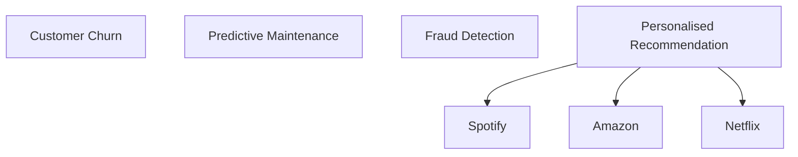
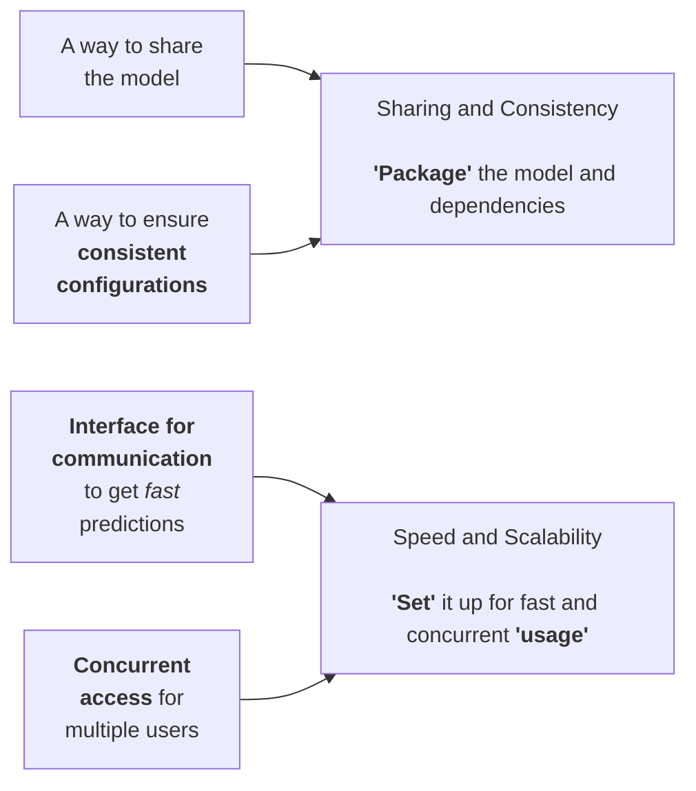

# 1.2 The Need of Model Deployment

Common Problems in Machine Learning:

**Process for ML Process**

- Gather Data
- Data Exploration -> Corelation (Univariate/ Bivariate Analysis)
- Preprocessing Data 
- Train Model -> Evaluate -> Hyperparameter Tuning (Decision Trees/Neural Networks/ XG Boost etc.)
- Tuning (Gennie)
- Best Model -> Deployment

Best model -> | How to expose the best model | --> customer

**Challenges with Python Nb:**
-  Accessability (Lot of Py code + company secrets)
-  need a simple way w/o exposing company's secrets
-  ensure dependencies are taken care of at customer's end (Platform Agnostic)
-  make sure ML model is generatinf recommendations that is fast enough (Latency/ Lag is min)
-  Approch is scalable (Horizontal scaling)

=================================================

# 1.3  Introduction to Model Deployment    

1. How can we share the model?
   - the model should also be re-trainable
2. Platform Agnostic

**Model Deployment**
- taking a trained ML model, package it and set it up for inference
- - we dont train it during deployment

**How do we package it?**

=================================================

# 1.4  Need for Model Serialization

**Environment**
- set of dpecific cond. and config under which software and systems operate

1. Development Environment
   - used for training ML models by `hyperparameter tuning`
2. Production Environment
   - used to deploy final ML model to serve end users

=================================================

# 1.5 Introduction to Model Serialization

